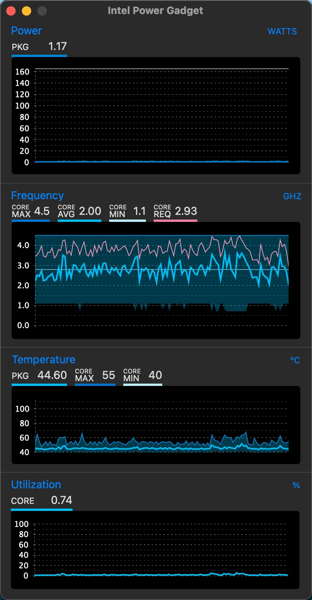

Intel Power Gadget 是因特尔官方出品的一款基于软件对 CPU 电源使用情况进行监控的小工具，它可以实时监控基于 Intel各平台（包括台式机或笔记本） CPU 的功耗、负载、频率、温度等情况，结果非常准确。

我主要是用来查看黑苹果下的睿频、功耗，还有配合其他工具做cpu温度监控。

### 下载

下载地址：[Intel® Power Gadget](https://software.intel.com/content/www/us/en/develop/articles/intel-power-gadget.html)

最新版本 3.7.0 for macos 。

### 运行

### 参考资料

- [Intel Power Gadget – Mac 上 CPU 监测工具](https://www.jianshu.com/p/20ca31fbf736)
- [Intel官方温度监控软件：Intel Power Gadget](https://www.mobibrw.com/2021/29181)