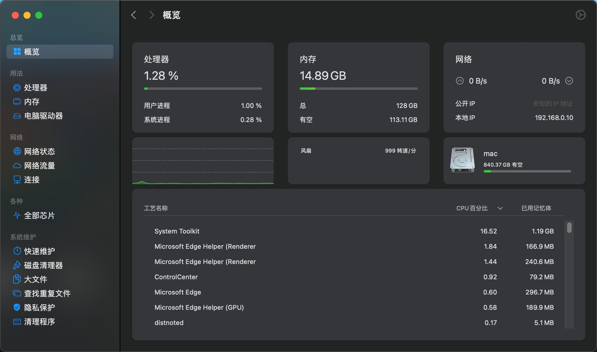
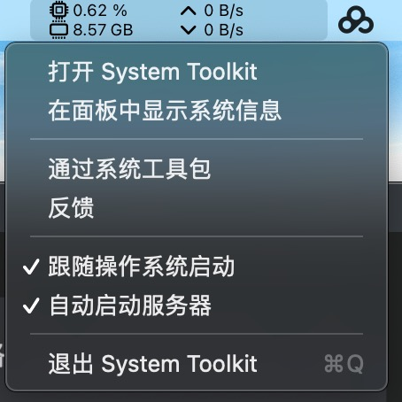

### 介绍

System Toolkit是Mac平台上的一款系统工具。System Toolkit提供了系统维护、隐私保护、[磁盘清理](http://www.ucbug.com/z/cipanql/)、电池维护、网络状态监控、网络流量监控等实用的功能。

通过 System Toolkit 可以随时监控到进程负载，CPU温度，主内存消耗，存储空间，磁盘活动，网络接口上的通信等。

### 下载

- 破解版本：[[System Toolkit 5.3.6 系统工具包 - 精品MAC应用分享 (xclient.info)](https://xclient.info/s/system-toolkit.html)](https://xclient.info/s/system-toolkit.html)

### 安装

###  安装 monitoring helper

在打开的界面上，选择 "download monitoring helper"，打开

https://sascha-simon.com/en/helper.html

下载 Helper.dmg 进行安装。重启 System Toolkit，在界面上选择 "auto start monitoring helper"

## 运行

概览页面：

平时在标题栏上的显示：

我一般打开自动启动：

