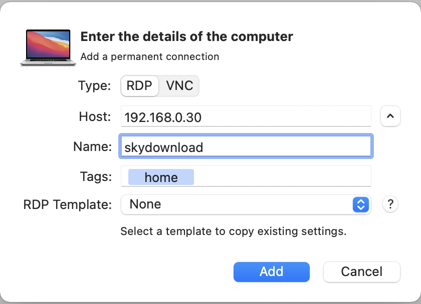

### 介绍

Jump Desktop 是MAC OS平台上的一款远程控制程序，支持Windows和Mac 双平台。

Jump Desktop 是一款Mac上非常强大和易用的远程桌面控制软件，支持RDP、VNC协议，无论速度、性能和流畅度上都非常不错，支持全屏、文本粘贴复制、快捷键发送等功能，可以用它远程连接Windows电脑，推荐使用！

### 下载

https://xclient.info/s/jump-desktop.html

### 安装

简单安装

### 使用

#### 连接windows

点 "+" 添加计算机，类型选择 RDP

添加后再修改属性：

- auto logon
- display
- quality

