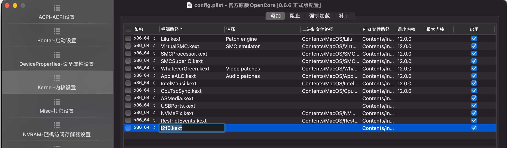

### 问题描述

华硕 x299 ws pro 主板自带两个intel i210 千兆有线网卡，在windows下使用正常，但是在安装big sur时会造成死机（系统panic）。在bios中屏蔽这两个网卡之后，可以正常安装 big sur 并进入系统。但是，如果再开启i210网卡，会在进入系统之后1-2分钟因内核panic而死机。

尝试用 intel 的几个主流驱动：

- intelmausi.kext：无效，而且明确说明不支持i210
- IntelMausiEthernet.kext：无效
- appleIGB.kext: 小众驱动，据说支持Intel 82575, 82576, 82580, dh89xxcc, i350, i210 and i211的网卡，但亲测无效。参考：[Inteli350,i210,i211小众网卡驱动，亲测微星z390战斧有效-远景论坛-微软极客社区 (pcbeta.com)](https://bbs.pcbeta.com/viewthread-1889369-1-1.html)

### 解决方案

参考：[Problems with Big Sur (macinabox) VM and Intel i210 network card after upgrading to 11.4 - VM Engine (KVM) - Unraid](https://forums.unraid.net/topic/109718-problems-with-big-sur-macinabox-vm-and-intel-i210-network-card-after-upgrading-to-114/)

下载附件中的i210.kext，加入oc引导文件:


发现可以成功的解决问题，两个网卡端口都被识别，网络连接可用，关键是系统不再死机：



使用到的 i210.kext 文件可以在这里直接下载：

[i210.kext 下载](./images/i210.kext.zip)

### 附录

未加载驱动时的panic信息：

```c
anic(cpu 8 caller 0xffffff8019516464): "Bad tailq elm 0xffffff86c5382100 next->prev != elm @732"@/System/Volumes/Data/SWE/macOS/BuildRoots/d7e177bcf5/Library/Caches/com.apple.xbs/Sources/xnu/xnu-7195.141.2/bsd/vfs/vfs_subr.c:732
mp = 0xffffff86ba56da30, phys = 0x8710dba30, prev (0xb: 0xff000000-0x100000000)
vp = 0xffffff86c5382100, phys = 0x8208ed100, prev (0xb: 0xff000000-0x100000000)
0xffffff86ba56c000: 0AAAAOoAAAAKAQAAOAhkJACAgAACAsLDGQkDAPDAIDjgIJCQAAABAAgODgxkJA4CwABA4IPDQEADAAYCEDQ8MJCQOAwBAABADwwBAw4DGQmAkPDAQEDgMAYCAAAoMIjOGAhoJACAgAAyM4LDGgkBAODAJChgIKOTAAABAMjOCgxoJAYDgABA4IJDQEADAAYCEDQ8MJCQPAwBAABADwwCAw8CGQmA0LDAQEDwMAYBAACYcCARMDB4HEBAwAAIBAYHGwsDA7DAAAQAAICAAAABAAkOikxgIAgAwgAgIAEBSAwBAAYCIDgcMJCQOAgBAIDACgwyMwQAGgiA4KDAjExgEAYCAAAoMAgOGAQIAADCAA3nfwAAAAAAgAIAAAADKwAAAAAGAIADobqG////CEKFuQAAAIACAAAAA1QAAAAPoboAvAAN538AAAAAAIACAAAAAyoAAAAABgCAD6G6ALYADed/AAAAAACAAgAAAAMiAAAAsAANAAAAgAIAAAAAoAANAAAAgAIAAAAAmgANAAAAgAIAAAAATkS6hv///wCUAA0AAACAAwAAAAMoAAAAABAAgLfsvhDk371wHiO6EEZwUYx/AAA0AAAAAAAAgAMAAAADGwAAAAAQAAD/7r4Q5N+9kFdwUTQAAAAAAACAAwAAAAcNAAAAABAAABzKvob///9wUWBRjH8AADQAAAAAAACAAwAAAAMYAAAAABAAADXzvhDk372QS3BRNAAAAAAAAIACAAAAA1AAAAAABgAIQoW5AMIADQAAAIACAAAAAAAAgAIAAACADqG6538AAAAAAIACAAAAgAShughChbkdCACAAAAFAACZ8YUAyla6ACAAAGhAhbkAoYWFAAAAgAEAAAAYRsS6AAAAgAMAAAADJwAAAAAQAABFRLqgTsS6ADizhQEAAAAAAACAIAAAAAAAyAZoAQAAAxAAAHAeI7oAAACAAgAAAAMwAACA16G6ANQADed/AAAAAACAaQEAADVSAAAAACAAgOuouqBx7LoEAAAAAAAAgAQAAAADGgAAAAAQAACNCb4Q5N+9gFFwUTQAAAAAAACAAwAAAAOgAAAAABAAgB9txQhChbkAQoELDAAAAODwMADgcOAMcOAADuBw7DkQwJDgBw4DEOw5Dgdw4DEM4OAADuA+DgVQ4AcO4D4OBTAJDg7gcez5AxDA4AcODxA8Dg4P4ODgBwAAApAeDggOAADp7u7gDAXgDA4HUOQODj4OBQ4ODgMADARQAgwEUAIMBFACDARQAgAwEAAlDAQIDARQAgMDxAABlDAADARQAgEIUAIBCFACBQQgACUEIAAlAHw+DARQAgMBygABlDAgDARQAgMzEAADlBAAaExuOAOUIAEBTI4qhpcwMCWEMDklIGw4BHxQAggyEAAlnFUCjAcwACWcLwAA
0xffffff86ba56d000: ngAAAKQAAACrAAAAhlKiU4KDGj+4AasAgiooKQAAAAAAAAAAAAAAAAAAAAAAAAAAAAAAAAAAAAAAAAAAAAAAAAAAAAAAAAAAAAAAAAAAAAAAAAAAAAAAACAoKCgAAAAAAAAAAAAAAAAAAAAAAAAAAAAAAAAAAAAAAAAAAAAAAAAAAAAAAAAAAAAAAAAAAAAAAAAAAAAAAAAAAICArl+KywQAKAAAAwgAaDQhE5BAgMSqlKrbIuOKL6qgKrAgKggIAAAAAAAAAAAAAAAAAAAAAAAAAAAAAAAAAAAAAAAAAAAAAAAAAAAAAAAAAAAAAAAAAAAAAAAAAAAAAACACgoKCgAAAAAAAAAAAAAAADCK4L2G////YORWuhDt1bWA7CiGAJCNvABPecUgc+C9UNBWugIQAAAAABhAIhtxB+PzWQI/JxcFjM9wCd1QaAkBAAA0HAAAAHR1eGVyYV9udGZzAC9Wb2x1bWVzL3dpbjEwAAAAL1ZvbHVtZXMvd2luMTAAL2Rldi9kaXNrMXMzMGgZhpP///8AAIAAAAgAAP8PAAAAEAAAIAAAANz////xVPb/I3IFAAAAACE/AAAAgCXbvQBz4L0xWCsSYORWugAAUro0OgAAoHg6xQAAAAIAP1IcgP///yDJHoYAv1S6AOZIy4b///8gQjjFACE4xSCwVLqQ2la6AJCQBEAA3YgQAAAAAAAQAFHW9w2z2P4MmDLBDJ79+ACofLkuAgAAABKRsC4JAAABGgAAAACQkARhcGZzL1N5c3RlbS9Wb2x1bWVzL0RhdGEAAAAvU3lzdGVtL1ZvbHVtZXMvRGF0YQAvZGV2L2Rpc2syczHu4O7uTtdOBOLgAOAODu4O7u7u7g4OBAAJ/P83kxsOBgAIEAD/P7A5hkMgAP8fYDj/T244
0xffffff86ba56e000: gAAAAIcAAACTAAAAAAAAAAAAAAAAAAAAAAAAAAAAAAAAAAAAAAAAAAAAAAAAAAAAAAAAAAAAAAAAAAAAgMSg4IYHhQsDQIlAAABCxBoNCARqEyIxKDWq9YgooQMroEIAAAICAgAAAAAAAAAAAAAAAAAAAAAAAAAAAAAAAAAAAAAAAAAAAAAAAAAAAAAAAAAAAAAAAAAAAAAAAAAAAICAgAICAgIAAAAAAAAAAAAAAAAAAAAAAAAAAAAAAAAAAAAAAAAAAAAAAAAAAAAAAAAAAAAAAAAAAAAAAAAAAAAAAACg8mh44QFhAgAQohCAQBAwBgMCQQEAAAAAAAAAAAAAAAAAAAAAAAAAAAAAAAAAu4WT////AAAIAIAAAAAAEAAAAACAAJcAAAD/jAIAAAAAIQDMTboFAAAAwLo3ugCwVLqwbAsXoHg6xQAAAAIFAAAAANBWujDaVrogE6y0QD0ohgCTjbwA2MzKIESPvLDkVrpAECAAAADQAAAgAAAAAAIA65UAANmHAAASDgAAAAIAAAEAAAEbAAAAbXNkby9Wb2x1bWVzL0VGSQAAAC9Wb2x1bWVzL0VGSQAvZGV2L2Rpc2swczEBAAAAsP5phZP///8AAAgAgAAAAAAQAAAAAIAAlwAAAEFwAgAAAAAhALxNugUAAACAam+8APQMvQO8XgkAQAAE4ADl7u7u4ODg7u7uBg5MAACQ4OAODu4OAQwAEAgIABH/Gx4AmxsOAQL8bzhn/v83kxsODHMMACAAISAAUfxvOJsbDgEC/G8A
Backtrace (CPU 8), Frame : Return Address
0xffffffa0b8d93aa0 : 0xffffff801928e04d mach_kernel : _handle_debugger_trap + 0x3fd
0xffffffa0b8d93af0 : 0xffffff80193d4e13 mach_kernel : _kdp_i386_trap + 0x143
0xffffffa0b8d93b30 : 0xffffff80193c540a mach_kernel : _kernel_trap + 0x55a
0xffffffa0b8d93b80 : 0xffffff8019232a2f mach_kernel : _return_from_trap + 0xff
0xffffffa0b8d93ba0 : 0xffffff801928d86d mach_kernel : _DebuggerTrapWithState + 0xad
0xffffffa0b8d93cc0 : 0xffffff801928db63 mach_kernel : _panic_trap_to_debugger + 0x273
0xffffffa0b8d93d30 : 0xffffff8019a9dc0a mach_kernel : _panic + 0x54
0xffffffa0b8d93da0 : 0xffffff8019516464 mach_kernel : _vnode_iterate + 0x424
0xffffffa0b8d93e50 : 0xffffff801c42ac02 com.apple.filesystems.apfs : _apfs_vfsop_sync + 0x89
0xffffffa0b8d93ea0 : 0xffffff801952a27b mach_kernel : _sync + 0x9b
0xffffffa0b8d93ec0 : 0xffffff8019515f3c mach_kernel : _vfs_iterate + 0x21c
0xffffffa0b8d93f30 : 0xffffff801952a1f7 mach_kernel : _sync + 0x17
0xffffffa0b8d93f40 : 0xffffff801994001e mach_kernel : _unix_syscall64 + 0x2ce
0xffffffa0b8d93fa0 : 0xffffff80192331f6 mach_kernel : _hndl_unix_scall64 + 0x16
      Kernel Extensions in backtrace:
         com.apple.filesystems.apfs(1677.141.1)[242980A5-2BD9-3F6C-85A9-59DC3D26221C]@0xffffff801c3ac000->0xffffff801c51bfff
            dependency: com.apple.driver.AppleEFINVRAM(2.1)[DC3B80FD-4D23-3608-8AA2-9C526D44F5D3]@0xffffff801a6fe000->0xffffff801a707fff
            dependency: com.apple.driver.AppleEffaceableStorage(1.0)[F406C391-FAEB-3AA0-B21B-081304E18302]@0xffffff801a711000->0xffffff801a716fff
            dependency: com.apple.iokit.CoreAnalyticsFamily(1)[89D4D6FD-0230-3AF2-9B37-12A0BE51DFE4]@0xffffff801ab6d000->0xffffff801ab73fff
            dependency: com.apple.iokit.IOStorageFamily(2.1)[6CD2A6EC-9FFC-370D-8FEE-C8016E5C6BBA]@0xffffff801be6f000->0xffffff801be80fff
            dependency: com.apple.kec.corecrypto(11.1)[8CCFD77D-8824-3F8C-82D3-AF011B1C38FC]@0xffffff801c549000->0xffffff801c5dafff
            dependency: com.apple.security.AppleImage4(3.0.0)[D403F64D-BB8C-3CE2-B75A-94982F595EC4]@0xffffff801a77d000->0xffffff801a78dfff

Process name corresponding to current thread: launchd
Boot args: keepsyms=1 alcid=1 agdpmod=pikera chunklist-security-epoch=0 -chunklist-no-rev2-dev chunklist-security-epoch=0 -chunklist-no-rev2-dev

Mac OS version:
20G80

Kernel version:
Darwin Kernel Version 20.6.0: Wed Jun 23 00:26:31 PDT 2021; root:xnu-7195.141.2~5/RELEASE_X86_64
Kernel UUID: FECBF22B-FBBE-36DE-9664-F12A7DD41D3D
KernelCache slide: 0x0000000019000000
KernelCache base:  0xffffff8019200000
Kernel slide:      0x0000000019010000
Kernel text base:  0xffffff8019210000
__HIB  text base: 0xffffff8019100000
System model name: MacPro7,1 (Mac-27AD2F918AE68F61)
System shutdown begun: NO
Panic diags file available: YES (0x0)
Hibernation exit count: 0

System uptime in nanoseconds: 151167792201
Last Sleep:           absolute           base_tsc          base_nano
  Uptime  : 0x00000023324d771b
  Sleep   : 0x0000000000000000 0x0000000000000000 0x0000000000000000
  Wake    : 0x0000000000000000 0x00000018f8309b87 0x0000000000000000
```

