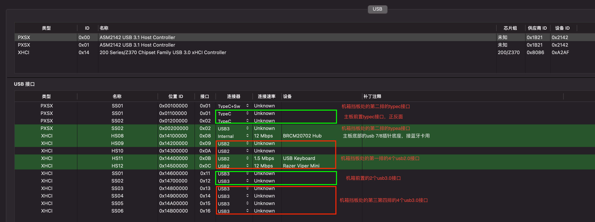

华硕x299 ws pro usb定制：

| 名称 | 位置                    | 速度     | 说明                       |
| ---- | ----------------------- | -------- | -------------------------- |
| SS01 | 主板第二排typec接口     | typec+sw | 正反面是同一个usb端口      |
| ss01 | 机箱前面板typec接口正面 | typec    | 正反面是不同的usb端口      |
| Ss02 | 机箱前面板typec接口反面 | typec    | 正反面是不同的usb端口      |
| Ss02 | 主板第二排typea接口     | Usb3     | usb3.1 gen2 10G速率        |
|      |                         |          |                            |
| HS08 | 主板usb78插针底座       | internal | 我用来接蓝牙（fenvi 919）  |
| HS09 | 主板第一排左侧第四个    | Usb2     |                            |
| HS10 | 主板第一排左侧第三个    | Usb2     |                            |
| HS11 | 主板第一排左侧第二个    | Usb2     | 键盘                       |
| HS12 | 主板第一排左侧第一个    | Usb2     | 鼠标                       |
|      |                         |          |                            |
| HS14 | 主板                    | Usb2     | 主板灯光，为了节约端口放弃 |
|      |                         |          |                            |
| Ss01 | 机箱前置usb上方         | Usb3     | 从主板前置接口接到机箱的   |
| Ss02 | 机箱前置usb下方         | usb3     |                            |
| Ss03 | 主板第四排右侧          | usb3     |                            |
| Ss04 | 主板第四排左侧          | usb3     |                            |
| ss05 | 主板第三排右侧          | usb3     |                            |
| Ss06 | 主板第三排左侧          | usb3     |                            |

## 特别说明

定制成功之后，导出的文件中，我开始按照以前的方式，加载 usbports.kext ，并将导出的两个 aml 文件复制到 `efi/oc/ACPI` 目录覆盖原有的文件。重启时发现无法启动。

在b站看了其他人的视频，导出之后有些人复制 aml 文件，有些人不复制而只更新 usbports.kext 文件，不清楚差别。

我尝试只更新不复制 aml 文件而只更新 usbports.kext 文件，发现顺利进入系统，定制成功了。

## 定制方式

### 第一次定制

由于端口不够，又猜不到蓝牙所在的端口到底是hs08还是hs07，因此舍去了主板第一排的两个usb2.0端口。

### 第二次定制

在第一次定制成功之后，确认蓝牙所接的是 hs08 接口，因此删除了 hs07 和 主板灯管的 usb 接口，开启了主板第一排的两个usb2.0端口，这样刚好所有usb端口都可以用，而且数量刚好是15个。
