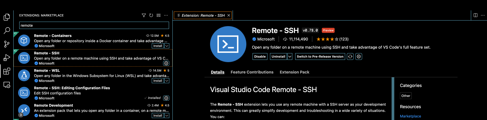

### m1上安装Virtual Studio Code

下载地址： https://code.visualstudio.com/Download

下载for mac Apple Silicon的的版本，解压缩zip文件，将得到的app文件拖到操作系统的applications文件夹中。

### 配置ssh免密码登录

```bash
# 将本地的 id_rsa.pub 传到远程
$ scp ~/.ssh/id_rsa.pub sky@dreamfly.io:/home/sky 

# 登录远程机器，这时需要密码
$ ssh sky@192.168.0.40
# 在远程机器上加入authorized_keys
$ cat id_rsa.pub >> ~/.ssh/authorized_keys
# 退出远程登录
$ exit
# 再次登录远程机器，这时不需要密码
$ ssh sky@192.168.0.40
```


### 安装remote ssh extension



remote ssh 扩展的介绍

> remote ssh 扩展让你使用任何有SSH服务器的远程机器作为你的开发环境。这可以大大简化各种情况下的开发和故障排除。你可以:
> 
> - 在你部署的同一操作系统上开发，或使用比你的本地机器更大、更快、更专业的硬件。
> - 在不同的远程开发环境之间快速交换，安全地进行更新，而不必担心影响你的本地机器。
> - 从多个机器或地点访问一个现有的开发环境。
> - 调试在其他地方运行的应用程序，如客户站点或云中。
>
> 没有源代码需要在你的本地机器上获得这些好处，因为该扩展直接在远程机器上运行命令和其他扩展。你可以打开远程机器上的任何文件夹，就像在你自己的机器上一样，对其进行操作。

开始使用，按照教程：

- 在vs code中按F1键，运行 "Remote-SSH：Open SSH Host... command."
- 在出现的输入框中以下列格式输入你的用户和主机/IP，然后按回车键：user@host-or-ip或user@domain@host-or-ip
- 连接后，使用 "文件">"打开文件夹 "在主机上打开一个文件夹。

你可以按F1键调出命令调色板，并输入Remote-SSH，以获得可用命令的完整列表。

